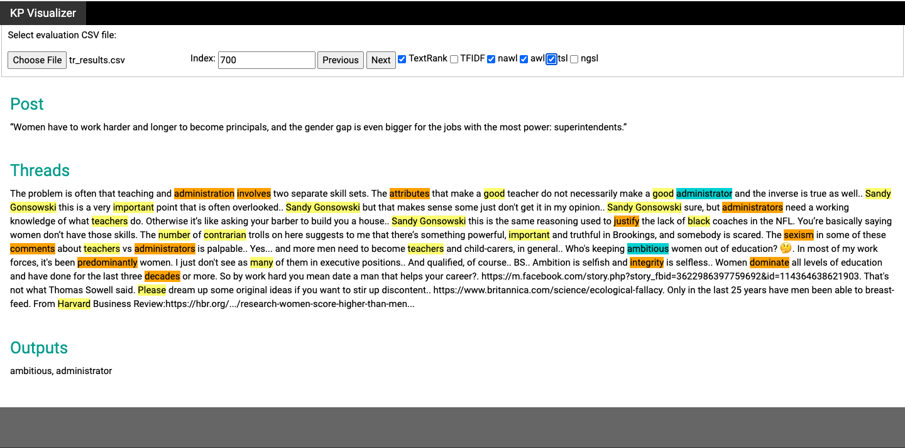

# Keyphrase visualizer

## Summary

I created this application while working on research for Dr. Yudong Liu at WWU. Our research is concern with identifying complex words for non-native english speakers for social media text and building language learning applications.

While building these models, we had issues with interpretable the results of our models. The precision, recall and F1 score do not always give us enough information regarding model performance. So I developed this tool that takes our results, and highlights the model outputs as well as expected values.

This visual analytic tool significantly improved interpretability and debugging of our NLP models.

## Sample Outputs

## Features

* Ability to cycle through different model inputs
* Highlights the outputs corresponding to different labels (real output, expected)
* Displays statistical information such as the probability attached to each output

